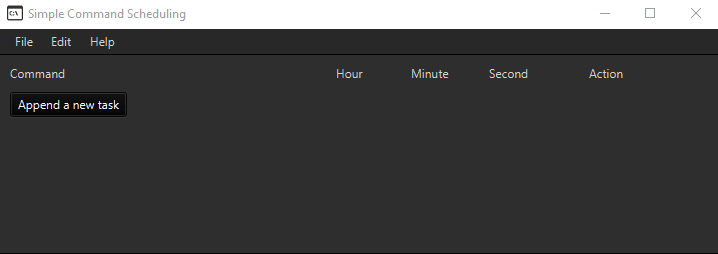
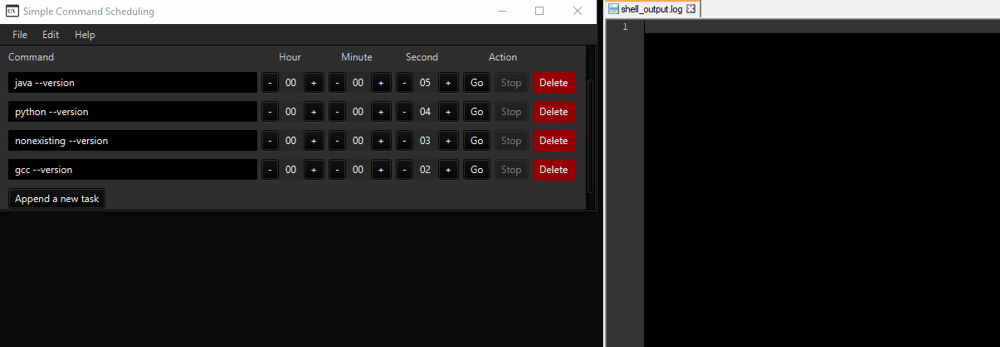

# simple-command-scheduling
A simple command scheduling (JavaFX)
Add commands for later execution (provide a countdown for commands HH:MM:SS).

Example use:

The time fields are updated in real time with the countdown.

Provides alert for non-existing commands.
Output redirection (`shell_output.log`)

