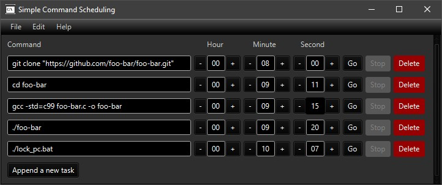

# simple-command-scheduling
A simple command scheduling (JavaFX)
Add commands for later execution (provide a countdown for commands HH:MM:SS).

Example use:

The countdown fields are updated in realtime.
